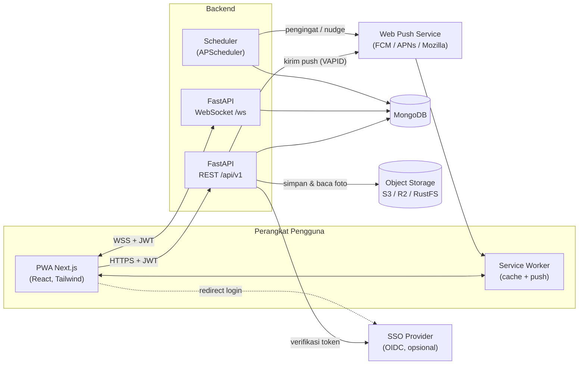
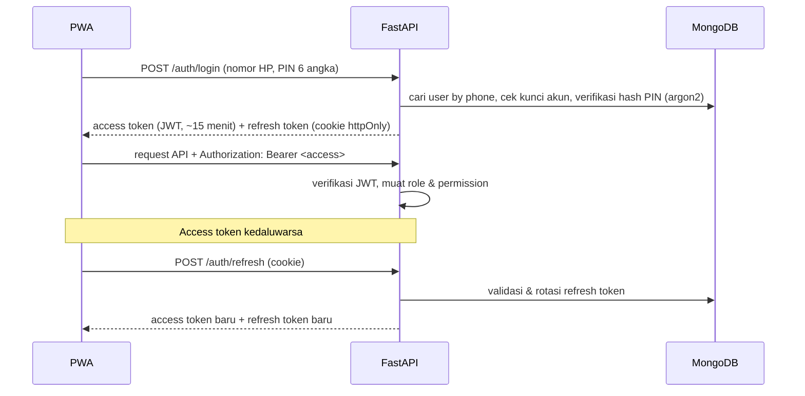
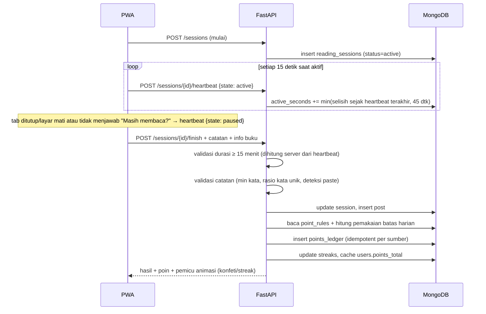
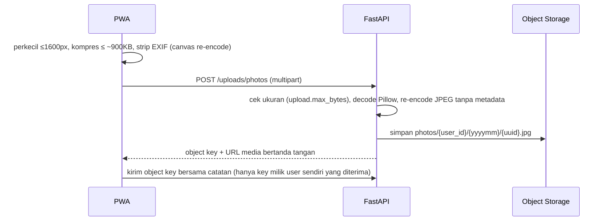

# ReadQuest — Arsitektur Sistem

> Turunan dari [`SPEC.md`](SPEC.md). Skema data lengkap ada di [`DATABASE.md`](DATABASE.md).

## 1. Gambaran Umum

ReadQuest adalah **monorepo** dengan dua aplikasi:

- **`frontend/`** — Next.js (App Router) sebagai PWA mobile-first.
- **`backend/`** — FastAPI yang menyediakan REST API (`/api/v1`) dan WebSocket (`/ws`).

Data utama disimpan di **MongoDB**. Foto buku disimpan di **object storage** S3-compatible.
Notifikasi dikirim lewat **Web Push** (VAPID). Pekerjaan terjadwal berjalan di **scheduler**
yang ada di dalam proses backend.

## 2. Diagram Komponen



## 3. Lapisan Backend

```
api/           Router FastAPI: validasi request, dependency auth & permission
  └─ services/       Logika bisnis (sesi baca, poin, feed, leaderboard, ...)
       └─ repositories/   Akses MongoDB (query + index), tanpa logika bisnis
ws/            Handler WebSocket (Reading Room, notifikasi realtime)
jobs/          Job terjadwal (memanggil services)
core/          Konfigurasi (.env), keamanan (JWT, hashing), koneksi DB, logging
models/        Bentuk dokumen MongoDB (Pydantic)
schemas/       DTO request/response API (Pydantic)
```

Aturan dependensi: `api`/`ws`/`jobs` → `services` → `repositories` → MongoDB.
Router tidak mengakses database secara langsung.

## 4. Alur Data Utama

### 4.1 Login & Token



Register (`POST /auth/register`) berisi nama, fungsi (`GET /auth/register-options`, publik),
nomor HP, dan PIN; akun langsung ber-role Member. Nomor HP dinormalisasi ke E.164 (`0812…`,
`62812…`, `+62 812…` dianggap sama). PIN mudah ditebak ditolak. Setelah `auth.max_pin_attempts`
kali PIN salah, akun terkunci `auth.lockout_minutes` menit (keduanya di `app_settings`), ditambah
rate limit per IP. Admin dapat reset PIN (`PUT /admin/users/{id}/pin`): kunci dibuka, refresh
token dicabut, dan access token lama ditolak lewat `sessions_revoked_at`. Pengguna mengganti PIN
lewat `PUT /me/pin`. SSO (OIDC) memakai alur yang sama setelah identitas diverifikasi provider.

### 4.2 Sesi Baca → Catatan → Poin



Durasi dihitung **di server** dari heartbeat agar timer di klien tidak bisa dimanipulasi:
setiap heartbeat hanya menambah waktu sejak heartbeat sebelumnya (maks.
`session.heartbeat_max_gap_seconds`) dan hanya bila sesi berstatus aktif. Celah panjang (layar
mati, jaringan putus) tidak dihitung.

- **Membaca buku fisik**: layar dijaga tetap menyala dengan Screen Wake Lock API. Karena tidak
  ada interaksi dengan layar, idle tidak langsung menjeda; setelah
  `session.idle_timeout_seconds` tanpa interaksi muncul dialog **"Masih membaca?"**, dan bila
  tidak dijawab dalam 60 detik sesi dijeda otomatis.
- **Aplikasi disembunyikan** (pindah aplikasi, layar dikunci) → sesi langsung dijeda.
- **Validasi catatan** (`services/note_validation.py`): minimal kata per jenis, rasio kata unik,
  kalimat berulang, porsi teks hasil paste (sinyal dari klien, dibatasi panjang teks), dan
  catatan identik dengan catatan sebelumnya (`content_hash`).
- **Maks. 1 sesi poin penuh per hari** dijamin unique partial index; sesi berikutnya tetap
  tercatat tanpa poin penuh.

**Poin saat sesi selesai** (`session_service._award_finish_points`, dalam transaksi yang sama
dengan posting sehingga tidak ada poin "yatim" bila penyelesaian gagal):

| Kondisi | Aturan (`point_rules.code`) |
|---------|-----------------------------|
| Sesi poin penuh pertama hari itu | `session_valid`, + `chapter_story` bila jenis catatan Chapter Story |
| Sesi poin penuh → streak diperbarui; mencapai 7/14/30/100 hari | `streak_7` … `streak_100` (sekali per streak) |
| Setiap catatan terkirim | `post_feed` (batas harian) |
| Menandai buku selesai | `book_finished` (sekali per buku per user) |
| Catatan berisi halaman saat ini + foto | `progress_photo` (maks. 1x/hari) |

`points_service.award()` membaca nilai & batas harian dari `point_rules`, menolak aturan
nonaktif, dan idempoten per (user, aturan, sumber). Saldo `users.stats.points_total` adalah
cache; `recompute_total()` menghitung ulang dari ledger. Koreksi Admin memakai `adjust()`
(entri baru `adjustment`/`reversal`, entri lama tidak pernah diubah).

### 4.3 Upload Foto Buku



Foto diunggah **lewat backend** (bukan presigned URL langsung ke storage) agar server bisa
memverifikasi bahwa file benar-benar gambar dan membuang metadata sekali lagi; ukurannya kecil
(≤ 1MB) sehingga biayanya rendah. Foto bersifat privat untuk tim dan disajikan lewat
`GET /api/v1/media/{key}?exp=&sig=`: URL bertanda tangan HMAC yang berlaku sampai akhir hari
berikutnya (stabil seharian sehingga bisa di-cache browser) dan bisa dipakai langsung di ``.

### 4.4 Reaksi / Komentar → Poin & Notifikasi

1. Pengguna memberi reaksi atau komentar → API menyimpan `reactions` / `comments`
   (`services/social_service.py`) dan memperbarui `posts.counts` dengan `$inc` atomik.
2. Service poin mengecek `point_rules` dan batas harian, lalu menulis `points_ledger`:
   - reaksi apa pun (Like/Insightful/Inspiring) dari orang lain → `like_received` untuk penulis.
     Dokumen reaksi tidak pernah dihapus (`type = null` saat dibatalkan) sehingga sumber poin
     tetap sama dan batal-lalu-like-lagi tidak memberi poin ganda;
   - komentar **bermakna** (≥ `comment.meaningful_min_words` kata, rasio kata unik cukup, bukan
     duplikat komentar sendiri) di posting orang lain → `meaningful_comment_given` (pemberi) dan
     `meaningful_comment_received` (penulis);
   - interaksi di posting sendiri tidak memberi poin.
   - Posting **diskusi buku** (`POST /books/{id}/discussions`, tanpa sesi baca) tidak memberi
     poin agar poin tetap berasal dari membaca.
3. Service notifikasi membuat dokumen `notifications`. Reaksi **di-batch** per posting
   (mis. "Rani dan 4 orang lain menyukai catatanmu").
4. Push dikirim bila sesuai preferensi pengguna dan di luar jam tenang. Lonceng in-app
   juga diperbarui lewat WebSocket bila pengguna sedang online.

### 4.5 Leaderboard

`services/leaderboard_service.py` — aggregation MongoDB per kategori:

| Kategori | Skor (tie-break) | Sumber |
|----------|------------------|--------|
| Top Storyteller | jumlah catatan baca (jumlah kata) | `posts` jenis Quick Note/Chapter Story/Book Review |
| Streak Master | hari membaca berbeda dalam periode (menit baca); sepanjang masa = streak terpanjang | `reading_sessions` selesai / `streaks` |
| Book Finisher | buku yang ditandai selesai | `posts.is_book_finished` |
| Most Inspiring | reaksi yang diterima dari orang lain (jumlah ✨ Inspiring) | `reactions` |
| Battle Antar-Fungsi | total poin ÷ anggota aktif fungsi (total poin) | `points_ledger.function_id` + `users` |

- Periode **mingguan** (Senin–Minggu, ISO week) dan **bulanan** dihitung menurut zona waktu
  tim (`team.timezone`); **sepanjang masa** tanpa batas. Peringkat kompetisi (1, 1, 3).
- Ranking lengkap disimpan di `leaderboard_snapshots` selama `leaderboard.cache_seconds`.
  Cache periode berjalan dibuang setiap ada aktivitas yang memengaruhi peringkat (poin,
  catatan, reaksi) sehingga perubahan langsung terlihat; periode yang sudah lewat dibekukan
  (`is_final`) dan bisa dibuka lewat `period_key` (navigasi ← →).

### 4.6 Reading Room (WebSocket)

- Klien terhubung ke `/ws/rooms/{room}` (`global` atau ID buku) lewat origin yang sama — Next.js
  meneruskan `/ws/*` ke FastAPI (rewrites mendukung upgrade WebSocket). Browser tidak bisa
  mengirim header `Authorization` pada WebSocket, jadi pesan pertama wajib
  `{type: "auth", token}` dalam 5 detik. Token sengaja tidak dikirim lewat query string agar
  tidak tercatat di access log. Token tidak valid → close `4401`, lalu klien me-refresh token
  dan menyambung ulang.
- Pesan klien: `status {reading, book_title, elapsed_seconds}` (dikirim timer sesi baca, dibulatkan
  per menit), `cheer {emoji, to}` (emoji dibatasi daftar, maks. 1 per 2 detik), `ping`.
  Server menyiarkan `presence {members}` dan `cheer`.
- State presence disimpan di memori proses (`app/ws/rooms.py`) — cukup untuk satu instance.
  Bila backend di-scale horizontal, broadcast diganti **Redis pub/sub**.

### 4.6.1 Authenticity Index & Gamifikasi

- **Authenticity Index** (`services/authenticity_service.py`): Contribution Ratio 30 hari =
  catatan / (catatan + komentar + reaksi yang diberikan). Ambang status dari
  `authenticity.thresholds`; tanpa aktivitas = Silent. Visibilitas ditegakkan di server:
  diri sendiri (`authenticity.view_self`), Team Lead untuk fungsi yang dipimpinnya beserta
  sub-fungsinya (`authenticity.view_team`, `functions.lead_user_ids`, fallback fungsi sendiri),
  Admin (`authenticity.view_all`). `run_daily()` menyimpan snapshot dan mengirim nudge lembut ke
  Observer maks. sekali per 7 hari (dijadwalkan di Fase 8).
- **Badge**: kriteria data-driven `{type, gte}` dengan `type` = metrik di
  `services/user_stats.py` (sesi, menit baca, catatan per jenis, buku selesai, reaksi diterima,
  komentar bermakna, streak terpanjang). Dievaluasi setelah sesi selesai, komentar bermakna, dan
  reaksi pertama yang diterima.
- **Quest**: quest berulang (`recurring: true`, periode minggu tim) atau bertanggal. Progres
  dihitung ulang dari data mentah dalam jendela quest (bukan counter), hadiah poin lewat ledger
  (`quest_reward`) sekali per user per periode (`user_quests.period_key`).
- **Book of the Month**: dipilih Admin (`config.books.manage`); bila belum ada, otomatis buku
  dengan posting terbanyak 30 hari terakhir.
- **Reading Buddy**: satu pasangan aktif per user; permintaan → terima (permintaan lain
  otomatis batal) → saling menyemangati (notifikasi, jeda 1 jam).

### 4.7 Job Terjadwal

Scheduler ringan di dalam proses backend (`app/jobs/scheduler.py`): satu loop asyncio yang
berdetak tiap menit. Hanya satu instance yang menjalankan job (lease 90 detik di koleksi
`job_locks`); job harian/mingguan ditandai di `scheduled_runs` agar tidak ganda. Jadwal diatur
lewat `app_settings.notifications.schedule` (data-driven).

| Job | Jadwal (default) | Fungsi |
|-----|------------------|--------|
| Pengingat baca | `reminder_time` tiap user (zona waktu user) | notifikasi bila belum ada sesi poin penuh hari itu |
| Streak terancam | 20:00 zona waktu user | bila streak ≥ 1 hari dan hari ini belum membaca |
| Leaderboard mingguan | Senin 09:00 zona waktu tim | ringkasan peringkat minggu lalu tiap user |
| Quest baru | Senin 08:00 zona waktu tim | info weekly quest yang aktif |
| Authenticity Index | 07:00 zona waktu tim | snapshot harian + nudge Observer (maks. 1x/7 hari) |
| Pengiriman push | setiap tick | kirim notifikasi yang `deliver_after`-nya sudah lewat |

Leaderboard tidak butuh job: dihitung saat diminta dengan cache (lihat §4.5).

### 4.8 Notifikasi & Web Push

- `notification_service.notify()` merender **template data-driven** (`notification_templates`),
  menghormati **preferensi** user (per jenis: push/lonceng), lalu menghitung `deliver_after`:
  jendela batching 5 menit untuk reaksi, **jam tenang** (push ditunda hingga jam tenang
  berakhir), dan **frekuensi** (`realtime`, `batched` per jam, `daily_digest`).
- **Batching**: notifikasi belum dibaca dengan `group_key` sama digabung ("Rani dan 3 lainnya
  mengapresiasi catatanmu"). Satu orang hanya menerima satu notifikasi per komentar
  (prioritas mention > balasan > komentar); tidak ada notifikasi untuk aksi sendiri.
- **Web Push**: VAPID (`pywebpush`). Kunci publik diambil frontend dari `GET /push/config`;
  langganan 404/410 dihapus, gagal berulang dibuang setelah 5 kali. Tanpa kunci VAPID, push
  dinonaktifkan dan notifikasi tetap tampil di lonceng.
- **Frontend**: `public/sw.js` (ditulis manual) menampilkan push dan membuka URL notifikasi saat
  diklik; lonceng di header mem-poll jumlah belum dibaca tiap 60 detik & saat aplikasi aktif
  kembali. Di iOS, push hanya tersedia setelah PWA dipasang ke Layar Utama (iOS 16.4+).

### 4.9 Admin Dashboard & Admin Config

- **Area admin** (`/admin/*` di frontend, `/api/v1/admin/*` di backend). Menu yang tampil
  diturunkan dari permission role pengguna (`features/admin/sections.ts`); setiap endpoint
  tetap dicek di server dengan `require_permission`, jadi menyembunyikan menu bukan satu-satunya
  pengaman.
- **Dashboard** (`admin_dashboard_service.build`): pembaca aktif & tingkat partisipasi, rata-rata
  menit baca, menit per hari, heatmap rata-rata menit/anggota per fungsi × hari dalam seminggu,
  distribusi status Authenticity Index, daftar Observer, dan buku terpopuler untuk periode 7/30/90
  hari. Export memakai data yang sama: **Excel** (`openpyxl`, 5 sheet) dan **PDF** (`fpdf2`
  dengan font Nunito yang dibundel), keduanya tercatat di audit log.
- **CRUD konfigurasi generik** (`admin_resources.RESOURCES`): satu registry berisi koleksi,
  permission, skema Pydantic, hook validasi (mis. hierarki fungsi tanpa siklus + `ancestors`
  dihitung ulang untuk sub-fungsi; role Admin tidak boleh kehilangan `config.roles.manage`;
  metrik badge/quest harus ada di `user_stats.METRICS`), dan penjaga hapus (data yang sudah
  dipakai cukup dinonaktifkan). Resource: fungsi, role, aturan poin, badge, quest, level,
  kategori buku, template notifikasi. Satu komponen frontend
  (`ResourceManager`) melayani semuanya; matriks permission punya halaman khusus.
- **Pengaturan** (`app_settings`) divalidasi per kunci; perubahan zona waktu/cache langsung
  membatalkan snapshot leaderboard yang masih terbuka.
- **Pengguna**: ubah role/fungsi/status. Admin tidak bisa mengubah role/status dirinya sendiri;
  menonaktifkan akun langsung mencabut semua refresh token.
- **Moderasi**: anggota melaporkan posting/komentar (`POST /posts/{id}/report`,
  `POST /posts/{id}/comments/{cid}/report`, satu laporan per orang) → status `flagged`. Admin
  menyembunyikan (opsional **membatalkan poin** lewat entri ledger `reversal` yang menunjuk
  entri asal, bukan menghapus ledger), memulihkan, atau mengabaikan laporan.
- **Audit log** (`audit_service.log`): setiap perubahan konfigurasi, pengguna, moderasi,
  Book of the Month, dan export menyimpan aktor, aksi, snapshot `before`/`after`, IP, dan
  user agent. Halaman Audit Log menampilkan diff per field dengan paginasi cursor.

### 4.10 PWA & Offline

- **Service worker** (`public/sw.js`, ditulis manual & diberi versi `VERSION`): precache halaman
  `/offline` beserta aset JS/CSS yang dirujuknya, ikon, dan manifest. Aset build ber-hash
  (`/_next/static/*`) memakai cache-first. Navigasi memakai network-first dengan fallback ke
  `/offline`. Data API (`/api/*`) dan WebSocket **tidak pernah di-cache** karena bersifat pribadi
  dan harus selalu terbaru.
- **Pembaruan versi**: SW baru tidak langsung `skipWaiting`. `PwaManager` menampilkan toast
  "Versi baru tersedia · Muat ulang"; setelah ditekan, SW baru aktif, cache lama dihapus, dan
  halaman dimuat ulang. Pembaruan dicek setiap kali aplikasi kembali dibuka.
- **Offline-aware auth**: klien API membedakan `NetworkError` (server tak terjangkau) dari sesi
  tidak valid. Saat offline, pengguna **tidak di-logout**. Aplikasi menampilkan layar offline
  dan mencoba lagi otomatis saat event `online`; di tengah pemakaian muncul banner offline.
- **Instal**: prompt `beforeinstallprompt` ditangkap dan ditawarkan lewat kartu "Pasang
  ReadQuest" di profil. Di iOS kartu menampilkan panduan Add to Home Screen. Manifest punya
  `id`, `scope`, ikon maskable, dan shortcut (Baca, Feed, Peringkat).
- Halaman `not-found`, `error`, dan `global-error` yang ramah pengguna. Font Nunito dibundel
  lokal (`next/font/local`) sehingga build tidak bergantung pada Google Fonts.

## 5. Alasan Pemilihan Teknologi

| Teknologi | Alasan |
|-----------|--------|
| **Next.js 16 (App Router) + TypeScript** | SSR/streaming untuk feed, routing berbasis file, ekosistem PWA matang, type safety. `/api/*` di-proxy (rewrites) ke FastAPI sehingga browser hanya melihat satu origin. |
| **Tailwind CSS + next-themes** | Mobile-first cepat, dark mode berbasis class. |
| **Animasi CSS** (+ Framer Motion bila perlu) | Mikro-animasi & transisi; konfeti via `canvas-confetti` (Fase 4+). |
| **Service worker manual** (`public/sw.js`) | Cukup kecil untuk ditulis tangan (push, klik notifikasi, cache aset, fallback offline) tanpa build step tambahan; versi & strategi cache eksplisit. |
| **FastAPI** | Async, WebSocket native, validasi Pydantic, OpenAPI otomatis untuk kontrak frontend. |
| **PyMongo async (`AsyncMongoClient`) + Pydantic v2** (tanpa ODM) | Driver async resmi MongoDB (pengganti Motor yang sudah deprecated); query & index tetap eksplisit dan mudah dioptimasi. |
| **MongoDB** | Skema fleksibel untuk konfigurasi data-driven (aturan poin, quest, template notifikasi); aggregation pipeline kuat untuk leaderboard dan heatmap. |
| **JWT + refresh token rotasi** | Stateless untuk API & WebSocket; refresh token di cookie httpOnly mengurangi risiko XSS. |
| **Object storage S3-compatible** | Foto tidak membebani database. Lokal memakai **RustFS** (Apache-2.0; image komunitas MinIO tidak lagi dipublikasikan), produksi S3/R2. Test memakai backend folder lokal. |
| **Web Push (VAPID) + pywebpush** | Standar terbuka, bekerja di Android & iOS 16.4+ (setelah Add to Home Screen). |
| **Scheduler internal + lease MongoDB** | Cukup untuk satu instance tanpa infrastruktur antrean tambahan; lease `job_locks` mencegah job ganda bila backend lebih dari satu. |
| **Docker Compose + Caddy** | Lokal: MongoDB + RustFS dengan satu perintah. Production: seluruh stack di satu host dengan HTTPS otomatis (Let's Encrypt). |

## 6. Keamanan

- **Secret** hanya di `.env` (tidak di-commit). Repo menyimpan `.env.example` berisi placeholder.
- **Password** di-hash dengan argon2.
- **RBAC**: setiap endpoint dilindungi dependency `require_permission("<kode>")`.
  Permission dibaca dari `roles` dan `permissions` (data-driven).
- **Rate limit** per user & IP untuk login, posting, reaksi, dan komentar, ditambah
  batas harian poin dari `point_rules`.
- **Validasi upload**: tipe MIME gambar saja, ukuran maksimum, dan EXIF dibuang di klien.
- **Visibilitas Authenticity Index** dicek di server (diri sendiri, Team Lead fungsinya, Admin).
- **Audit log** (append-only) untuk setiap perubahan konfigurasi, pengguna, moderasi, dan export.
- Frontend memanggil API lewat proxy same-origin Next.js. CORS hanya mengizinkan origin frontend.
- Refresh token di cookie `HttpOnly`, `SameSite=Strict`, `Path=/api/v1/auth`, dan `Secure` di production.
  Access token hanya disimpan di memori frontend.
- **Header keamanan**: Next.js mengirim CSP tanpa nonce (`default-src 'self'`,
  `frame-ancestors 'none'`, `object-src 'none'`, `connect-src 'self'`; `'unsafe-inline'` untuk
  script dibutuhkan payload RSC agar halaman tetap statis), `X-Frame-Options: DENY`, `nosniff`,
  `Referrer-Policy`, `Permissions-Policy`, dan COOP. FastAPI menambahkan `nosniff`, `DENY`,
  `Referrer-Policy: no-referrer`, CORP, dan `Cache-Control: no-store` default untuk data API.
  Caddy menambahkan HSTS.
- **Batas ukuran request** 12 MB di Caddy dan middleware FastAPI (Content-Length & streaming).
- **IP klien** untuk rate limit diambil dari `X-Forwarded-For` hanya bila peer tepercaya
  (`--proxy-headers` + `FORWARDED_ALLOW_IPS`, backend tidak terekspos publik).
- **Konfigurasi production divalidasi saat start**: secret JWT kuat, cookie `Secure`,
  `FRONTEND_ORIGIN` HTTPS, dan kredensial S3 wajib ada. OpenAPI/docs dimatikan.
- **Token WebSocket** dikirim sebagai pesan pertama, bukan query string, agar tidak tercatat di
  access log.
- Image Docker berjalan sebagai user non-root. Dependensi diaudit (`npm audit`, `pip-audit`).

## 7. Konfigurasi Lingkungan

Semua konfigurasi lewat variabel lingkungan:

| File | Isi |
|------|-----|
| `.env` (root) | kredensial object storage (RustFS) untuk `docker-compose.yml` |
| `backend/.env` | URL MongoDB, secret JWT, kredensial object storage, kunci VAPID, `MAX_REQUEST_BYTES` |
| `frontend/.env.local` | `API_PROXY_TARGET` (alamat FastAPI untuk proxy; dibaca saat build). Kunci publik VAPID diambil dari backend |
| `deploy/.env` | Seluruh konfigurasi stack production (domain, secret, admin pertama) — lihat `DEPLOYMENT.md` |

Lihat `.env.example` di masing-masing lokasi.

## 8. Deployment

Jalur utama: satu host dengan `deploy/docker-compose.yml`, yaitu **Caddy** (HTTPS otomatis) →
**frontend** (Next.js standalone) → **backend** (FastAPI, satu instance) → **MongoDB** (replica
set) + **RustFS**. Database & storage berada di jaringan internal tanpa port publik. Alternatif
terkelola yang didokumentasikan langkah demi langkah: **Railway** (frontend publik `*.up.railway.app`,
backend di jaringan privat) + **MongoDB Atlas** + **Cloudflare R2**. CI membangun kedua
image dan menjalankan smoke test stack lengkap di setiap PR.

Langkah, variabel lingkungan, backup, dan checklist keamanan: [`DEPLOYMENT.md`](DEPLOYMENT.md).
