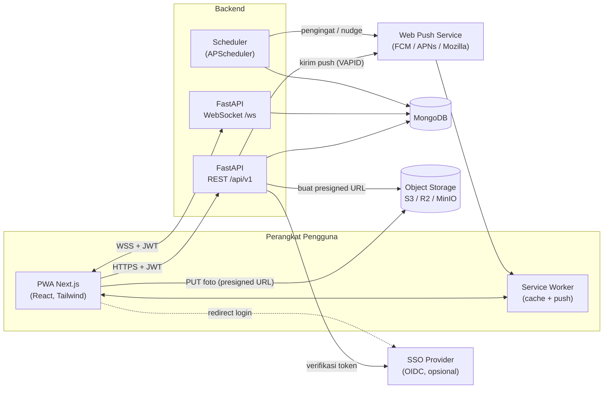
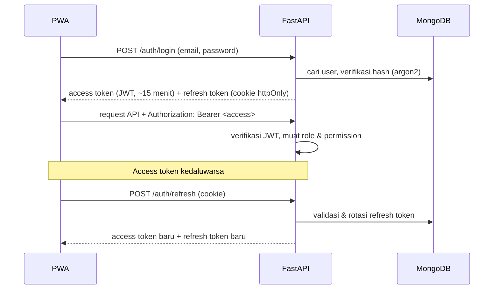
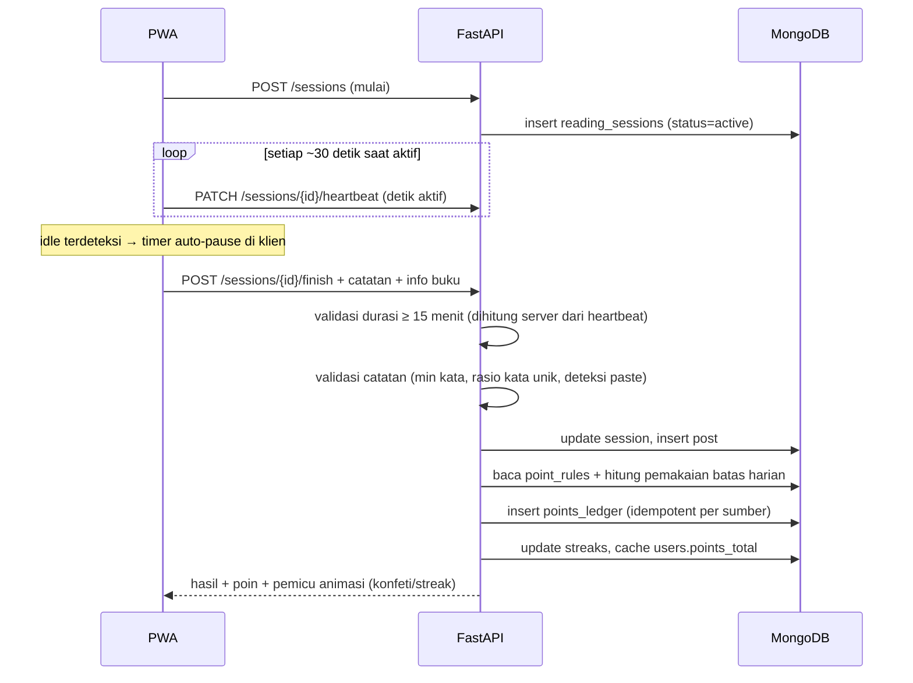
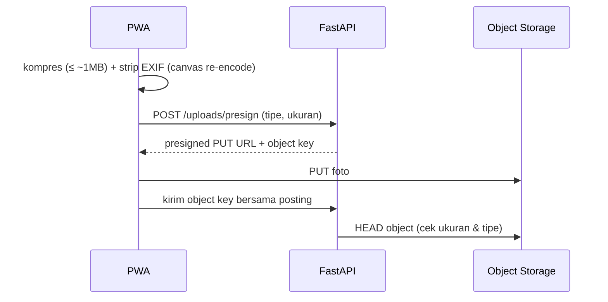

# ReadQuest — Arsitektur Sistem

> Turunan dari [`SPEC.md`](SPEC.md). Skema data lengkap ada di [`DATABASE.md`](DATABASE.md).

## 1. Gambaran Umum

ReadQuest adalah **monorepo** dengan dua aplikasi:

- **`frontend/`** — Next.js (App Router) sebagai PWA mobile-first.
- **`backend/`** — FastAPI yang menyediakan REST API (`/api/v1`) dan WebSocket (`/ws`).

Data utama disimpan di **MongoDB**. Foto buku disimpan di **object storage** S3-compatible.
Notifikasi dikirim lewat **Web Push** (VAPID). Pekerjaan terjadwal berjalan di **scheduler**
yang ada di dalam proses backend.

## 2. Diagram Komponen



## 3. Lapisan Backend

```
api/           Router FastAPI: validasi request, dependency auth & permission
  └─ services/       Logika bisnis (sesi baca, poin, feed, leaderboard, ...)
       └─ repositories/   Akses MongoDB (query + index), tanpa logika bisnis
ws/            Handler WebSocket (Reading Room, notifikasi realtime)
jobs/          Job terjadwal (memanggil services)
core/          Konfigurasi (.env), keamanan (JWT, hashing), koneksi DB, logging
models/        Bentuk dokumen MongoDB (Pydantic)
schemas/       DTO request/response API (Pydantic)
```

Aturan dependensi: `api`/`ws`/`jobs` → `services` → `repositories` → MongoDB.
Router tidak mengakses database secara langsung.

## 4. Alur Data Utama

### 4.1 Login & Token



Pendaftaran baru wajib membawa **kode undangan** (`invite_codes`). SSO (OIDC) memakai
alur yang sama setelah identitas diverifikasi provider.

### 4.2 Sesi Baca → Catatan → Poin



Durasi dihitung **di server** dari heartbeat agar timer di klien tidak bisa dimanipulasi.
Deteksi paste dikirim klien sebagai sinyal (jumlah karakter yang di-paste) dan dicek ulang
di server.

### 4.3 Upload Foto Buku



### 4.4 Reaksi / Komentar → Poin & Notifikasi

1. Pengguna memberi reaksi atau komentar → API menyimpan `reactions` / `comments`.
2. Service poin mengecek `point_rules` dan batas harian, lalu menulis `points_ledger`
   untuk penerima (dan pemberi, untuk komentar bermakna).
3. Service notifikasi membuat dokumen `notifications`. Reaksi **di-batch** per posting
   (mis. "Rani dan 4 orang lain menyukai catatanmu").
4. Push dikirim bila sesuai preferensi pengguna dan di luar jam tenang. Lonceng in-app
   juga diperbarui lewat WebSocket bila pengguna sedang online.

### 4.5 Leaderboard

- Dihitung dengan **aggregation** atas `points_ledger` (dan `reading_sessions`/`posts`
  untuk kategori non-poin) per periode.
- Hasil di-cache di `leaderboard_snapshots`: diperbarui berkala oleh scheduler, dan
  dibekukan setiap akhir minggu/bulan untuk riwayat.
- Battle Antar-Fungsi: total poin per fungsi ÷ jumlah anggota aktif fungsi tersebut.

### 4.6 Reading Room (WebSocket)

- Klien terhubung ke `/ws/rooms/{room_id}` dengan JWT.
- Server menyiarkan presence (siapa sedang membaca, buku apa, durasi) dan reaksi ringan.
- Untuk satu instance, state disimpan di memori. Bila backend di-scale horizontal,
  ditambahkan **Redis pub/sub** (direncanakan di Fase 7).

### 4.7 Job Terjadwal

| Job | Jadwal | Fungsi |
|-----|--------|--------|
| Pengingat baca | per jam, sesuai preferensi user | push pengingat bila belum baca hari ini |
| Streak terancam | malam hari (zona waktu user) | push bila streak akan putus |
| Snapshot leaderboard | tiap 15 menit + akhir periode | perbarui cache leaderboard |
| Authenticity Index | harian | hitung Contribution Ratio 30 hari, simpan snapshot, kirim nudge Observer |
| Batching notifikasi | tiap 5 menit | gabungkan reaksi & kirim push |
| Weekly quest | awal minggu | aktifkan quest baru + notifikasi |

## 5. Alasan Pemilihan Teknologi

| Teknologi | Alasan |
|-----------|--------|
| **Next.js (App Router) + TypeScript** | SSR/streaming untuk feed, routing berbasis file, ekosistem PWA matang, type safety. |
| **Tailwind CSS + next-themes** | Mobile-first cepat, dark mode berbasis class. |
| **Framer Motion** | Mikro-animasi & transisi; konfeti via `canvas-confetti`. |
| **Serwist** (`@serwist/next`) | Service worker modern untuk Next.js: offline cache & handler push. |
| **FastAPI** | Async, WebSocket native, validasi Pydantic, OpenAPI otomatis untuk kontrak frontend. |
| **Motor + Pydantic v2** (tanpa ODM) | Driver async resmi MongoDB; query & index tetap eksplisit dan mudah dioptimasi. |
| **MongoDB** | Skema fleksibel untuk konfigurasi data-driven (aturan poin, quest, template notifikasi); aggregation pipeline kuat untuk leaderboard dan heatmap. |
| **JWT + refresh token rotasi** | Stateless untuk API & WebSocket; refresh token di cookie httpOnly mengurangi risiko XSS. |
| **Object storage S3-compatible** | Foto tidak membebani database; presigned URL membuat upload langsung dari klien. MinIO untuk lokal, S3/R2 di produksi. |
| **Web Push (VAPID) + pywebpush** | Standar terbuka, bekerja di Android & iOS 16.4+ (setelah Add to Home Screen). |
| **APScheduler** | Cukup untuk satu instance tanpa infrastruktur antrean tambahan; dapat diganti worker terpisah bila skala bertambah. |
| **Docker Compose** | Menjalankan MongoDB + MinIO secara lokal dengan satu perintah. |

## 6. Keamanan

- **Secret** hanya di `.env` (tidak di-commit). Repo menyimpan `.env.example` berisi placeholder.
- **Password** di-hash dengan argon2.
- **RBAC**: setiap endpoint dilindungi dependency `require_permission("<kode>")`.
  Permission dibaca dari `roles` dan `permissions` (data-driven).
- **Rate limit** per user & IP untuk login, posting, reaksi, dan komentar, ditambah
  batas harian poin dari `point_rules`.
- **Validasi upload**: tipe MIME gambar saja, ukuran maksimum, dan EXIF dibuang di klien.
- **Visibilitas Authenticity Index** dicek di server (diri sendiri, Team Lead fungsinya, Admin).
- **Audit log** untuk setiap perubahan konfigurasi admin.
- CORS dibatasi ke origin frontend. Cookie memakai `Secure`, `HttpOnly`, `SameSite=Lax`.

## 7. Konfigurasi Lingkungan

Semua konfigurasi lewat variabel lingkungan:

| File | Isi |
|------|-----|
| `.env` (root) | kredensial MongoDB & MinIO untuk `docker-compose.yml` |
| `backend/.env` | URL MongoDB, secret JWT, kredensial object storage, kunci VAPID, SSO |
| `frontend/.env` | URL API & WebSocket, kunci publik VAPID |

Lihat `.env.example` di masing-masing lokasi.

## 8. Deployment (Gambaran)

- **Frontend**: Vercel atau container Node.
- **Backend**: container (Docker) di layanan seperti Fly.io, Railway, atau Cloud Run.
  Satu instance pada awalnya (scheduler & Reading Room di dalam proses).
- **Database**: MongoDB Atlas.
- **Object storage**: Cloudflare R2 atau AWS S3.
- HTTPS wajib (syarat Service Worker & Web Push).
- Detail deployment difinalkan di Fase 10.
