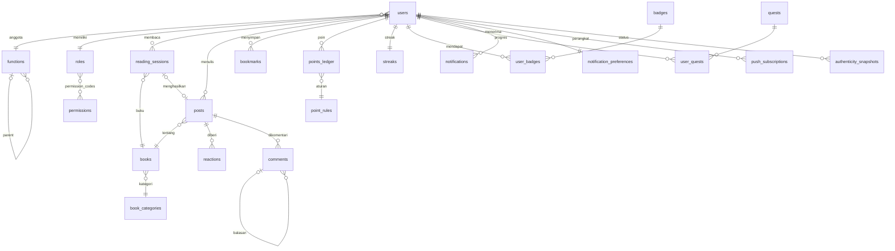

# ReadQuest — Skema Database (MongoDB)

> Turunan dari [`SPEC.md`](SPEC.md) dan [`ARCHITECTURE.md`](ARCHITECTURE.md).
> Nilai bisnis (poin, batas, threshold) **tidak** di-hardcode: semuanya ada di koleksi
> konfigurasi (`point_rules`, `levels`, `app_settings`, dst.).

## 1. Konvensi Umum

| Konvensi | Keterangan |
|----------|------------|
| `_id` | `ObjectId`. Referensi ke koleksi lain memakai nama `<entitas>_id` bertipe `ObjectId`. |
| `created_at`, `updated_at` | `Date` dalam UTC, ada di semua koleksi kecuali yang append-only (hanya `created_at`). |
| `deleted_at` | `Date \| null`. Soft delete untuk konten pengguna (posts, comments) dan data master. |
| `local_date` | `string` `YYYY-MM-DD` menurut zona waktu pengguna. Dipakai untuk aturan harian. |
| `code` | `string` slug stabil (mis. `session_valid`) untuk data konfigurasi yang dirujuk kode. |
| Penamaan | Koleksi `snake_case` jamak; field `snake_case`. |
| Denormalisasi | Data kecil yang sering ditampilkan (nama, avatar, judul buku) disalin ke dokumen dan disinkronkan saat berubah, untuk menghindari `$lookup` di feed. |

## 2. Daftar Koleksi

| Kelompok | Koleksi |
|----------|---------|
| Identitas & akses | `users`, `refresh_tokens`, `functions`, `roles`, `permissions` |
| Buku | `books`, `book_categories` |
| Aktivitas baca | `reading_sessions`, `streaks` |
| Sosial | `posts`, `reactions`, `comments`, `bookmarks` |
| Poin & gamifikasi | `points_ledger`, `point_rules`, `levels`, `badges`, `user_badges`, `quests`, `user_quests`, `leaderboard_snapshots`, `authenticity_snapshots` |
| Notifikasi | `notifications`, `notification_preferences`, `push_subscriptions` |
| Sistem | `audit_logs`, `app_settings` |

## 3. Diagram Relasi (ringkas)

---

## 4. Identitas & Akses

### 4.1 `users`

| Field | Tipe | Keterangan |
|-------|------|------------|
| `phone` | string | nomor HP ternormalisasi E.164 (mis. `+6281234567890`), unik; dipakai untuk login |
| `email` | string \| (tidak ada) | opsional (akun lama); lowercase, unik bila ada |
| `password_hash` | string \| null | hash argon2 dari **PIN 6 angka**; `null` jika hanya SSO |
| `login_failures` | int | PIN salah berturut-turut sejak login sukses terakhir |
| `locked_until` | Date \| null | akun terkunci sampai waktu ini (`auth.max_pin_attempts` / `auth.lockout_minutes`) |
| `sessions_revoked_at` | Date \| null | access token yang terbit sebelum waktu ini ditolak (mis. setelah Admin reset PIN) |
| `sso` | object \| null | `{ provider, subject }` |
| `name` | string | nama tampilan |
| `avatar_url` | string \| null | |
| `role_id` | ObjectId → `roles` | |
| `function_id` | ObjectId → `functions` | fungsi/bagian |
| `interests` | ObjectId[] → `book_categories` | minat baca |
| `daily_target_minutes` | int | target harian (default dari `app_settings`) |
| `timezone` | string | IANA, mis. `Asia/Jakarta` |
| `onboarding_completed_at` | Date \| null | |
| `stats` | object | cache: `{ points_total, level_id, books_finished, posts_count, current_streak }` (diturunkan dari ledger/aktivitas) |
| `status` | string | `active` \| `suspended` |
| `last_active_at` | Date | |
| `created_at`, `updated_at` | Date | |

**Index:**
- `{ phone: 1 }` unique, partial (`phone` string) — `phone_unique`
- `{ email: 1 }` unique, partial (`email` string) — `email_unique_optional`
- `{ "sso.provider": 1, "sso.subject": 1 }` unique, partial (`sso` ada)
- `{ function_id: 1, status: 1 }`: leaderboard & heatmap per fungsi
- `{ role_id: 1 }`

### 4.2 `refresh_tokens`

| Field | Tipe | Keterangan |
|-------|------|------------|
| `user_id` | ObjectId → `users` | |
| `token_hash` | string | SHA-256 dari token; token asli tidak disimpan |
| `family_id` | string | untuk deteksi reuse (rotasi) |
| `user_agent`, `ip` | string | |
| `expires_at` | Date | |
| `revoked_at` | Date \| null | |
| `created_at` | Date | |

**Index:** `{ token_hash: 1 }` unique · `{ user_id: 1 }` · `{ expires_at: 1 }` TTL (`expireAfterSeconds: 0`)

### 4.3 `invite_codes` (tidak dipakai lagi)

Register tidak lagi memakai kode undangan. Koleksi lama dibiarkan apa adanya (tanpa index yang
dikelola aplikasi) dan tidak dibaca/ditulis oleh kode.

### 4.4 `functions` (Fungsi/Bagian, hierarkis)

| Field | Tipe | Keterangan |
|-------|------|------------|
| `name` | string | mis. "Finance" |
| `code` | string | slug unik |
| `parent_id` | ObjectId \| null → `functions` | |
| `ancestors` | ObjectId[] | semua leluhur (root → parent), untuk query subtree |
| `lead_user_ids` | ObjectId[] → `users` | Team Lead fungsi ini |
| `is_active` | bool | |
| `sort_order` | int | |
| `created_at`, `updated_at` | Date | |

**Index:** `{ code: 1 }` unique · `{ parent_id: 1, sort_order: 1 }` · `{ ancestors: 1 }`

### 4.5 `roles`

| Field | Tipe | Keterangan |
|-------|------|------------|
| `code` | string | `member`, `team_lead`, `admin`, atau role kustom |
| `name` | string | |
| `description` | string | |
| `permission_codes` | string[] → `permissions.code` | matriks RBAC |
| `is_system` | bool | role bawaan tidak bisa dihapus |
| `created_at`, `updated_at` | Date | |

**Index:** `{ code: 1 }` unique

### 4.6 `permissions`

Katalog permission (di-seed dari kode, dapat diberi label oleh admin).

| Field | Tipe | Keterangan |
|-------|------|------------|
| `code` | string | mis. `post.create`, `post.moderate`, `authenticity.view_team`, `config.points.manage` |
| `group` | string | pengelompokan di UI matriks (mis. `feed`, `admin`) |
| `description` | string | |
| `created_at` | Date | |

**Index:** `{ code: 1 }` unique · `{ group: 1 }`

---

## 5. Buku

### 5.1 `books` (katalog bersama: 1 buku = 1 halaman diskusi)

| Field | Tipe | Keterangan |
|-------|------|------------|
| `title` | string | wajib |
| `authors` | string[] | wajib, minimal 1 |
| `category_id` | ObjectId → `book_categories` | wajib |
| `normalized_key` | string | `slug(title)\|slug(author pertama)`, mencegah duplikat |
| `cover_image_key` | string \| null | object key foto sampul utama |
| `publisher` | string \| null | opsional |
| `year` | int \| null | opsional |
| `total_pages` | int \| null | opsional |
| `isbn` | string \| null | opsional |
| `stats` | object | cache: `{ readers_count, posts_count, avg_rating, finished_count }` |
| `is_book_of_the_month` | object \| null | `{ month: "2026-10" }` |
| `created_by` | ObjectId → `users` | |
| `created_at`, `updated_at` | Date | |

**Index:**
- `{ normalized_key: 1 }` unique
- `{ title: "text", authors: "text" }`: pencarian
- `{ category_id: 1, "stats.posts_count": -1 }`

### 5.2 `book_categories`

| Field | Tipe | Keterangan |
|-------|------|------------|
| `name` | string | |
| `code` | string | slug unik |
| `icon` | string \| null | |
| `is_active` | bool | |
| `sort_order` | int | |
| `created_at`, `updated_at` | Date | |

**Index:** `{ code: 1 }` unique

---

## 6. Aktivitas Baca

### 6.1 `reading_sessions`

| Field | Tipe | Keterangan |
|-------|------|------------|
| `user_id` | ObjectId → `users` | |
| `book_id` | ObjectId → `books` | |
| `book` | object | denormalisasi `{ title, authors, cover_image_key }` untuk tampilan |
| `local_date` | string | tanggal sesi menurut zona waktu user (diperbarui ke tanggal selesai) |
| `started_at` | Date | |
| `ended_at` | Date \| null | |
| `active_seconds` | int | dihitung server dari heartbeat (tanpa waktu idle/pause) |
| `last_heartbeat_at` | Date | |
| `status` | string | `active` \| `paused` \| `completed` \| `abandoned` \| `rejected` |
| `note_type` | string \| null | `quick_note` \| `chapter_story` \| `book_review` |
| `post_id` | ObjectId \| null → `posts` | catatan yang dihasilkan |
| `validation` | object | `{ word_count, unique_word_ratio, pasted_chars, passed, reasons[] }` |
| `is_full_points` | bool | `true` hanya untuk sesi poin penuh pertama hari itu |
| `page_progress` | object \| null | `{ from_page, to_page }` |
| `created_at`, `updated_at` | Date | |

**Index:**
- `{ user_id: 1, local_date: 1 }` **unique, partial** `{ is_full_points: true }`: menjamin maks. 1 sesi poin penuh per hari
- `{ user_id: 1, started_at: -1 }`: riwayat
- `{ status: 1, last_heartbeat_at: 1 }`: job penutup sesi menggantung
- `{ local_date: 1 }`: statistik harian admin (rata-rata menit, heatmap)

### 6.2 `streaks`

Satu dokumen per user.

| Field | Tipe | Keterangan |
|-------|------|------------|
| `user_id` | ObjectId → `users` | |
| `current` | int | hari berturut-turut |
| `longest` | int | |
| `last_read_date` | string | `local_date` sesi valid terakhir |
| `milestones_awarded` | int[] | mis. `[7, 14]`, mencegah bonus ganda; dikosongkan saat streak putus |
| `freeze_tokens` | int | cadangan untuk fitur masa depan |
| `updated_at` | Date | |

**Index:** `{ user_id: 1 }` unique · `{ current: -1 }` (Streak Master)

---

## 7. Sosial

### 7.1 `posts`

| Field | Tipe | Keterangan |
|-------|------|------------|
| `author_id` | ObjectId → `users` | |
| `author` | object | denormalisasi `{ name, avatar_url, function_id }` |
| `session_id` | ObjectId \| null → `reading_sessions` | |
| `book_id` | ObjectId → `books` | |
| `book` | object | denormalisasi `{ title, authors, category_id }` |
| `type` | string | `quick_note` \| `chapter_story` \| `book_review` \| `progress_photo` \| `discussion` |
| `content` | string | teks catatan |
| `word_count` | int | |
| `content_hash` | string | SHA-256 dari kata-kata yang dinormalisasi; menolak catatan duplikat |
| `image_keys` | string[] | foto buku/progres (object storage, prefix `photos/{author_id}/`) |
| `rating` | int \| null | 1–5, opsional |
| `page_progress` | object \| null | `{ current_page, total_pages }` |
| `is_book_finished` | bool | memicu +150 poin (sekali per user per buku) |
| `topics` | string[] | tag topik untuk filter |
| `mentions` | ObjectId[] → `users` | |
| `counts` | object | cache: `{ like, insightful, inspiring, comments, bookmarks }` |
| `visibility` | string | `team` (default) |
| `moderation` | object | `{ status: "visible" \| "hidden" \| "flagged", by, reason, at }` |
| `reports` | object[] | laporan anggota `{ user_id, reason, at }`; satu laporan per user, dikosongkan saat Admin "abaikan" |
| `deleted_at` | Date \| null | |
| `created_at`, `updated_at` | Date | |

**Index:**
- `{ created_at: -1 }`: feed utama
- `{ "author.function_id": 1, created_at: -1 }`: filter per fungsi
- `{ book_id: 1, created_at: -1 }`: halaman diskusi buku
- `{ topics: 1, created_at: -1 }`: filter topik
- `{ author_id: 1, created_at: -1 }`: profil & Authenticity Index
- `{ author_id: 1, book_id: 1 }` unique, partial `{ is_book_finished: true }`: buku selesai sekali
- `{ "moderation.status": 1, updated_at: -1 }`: antrean moderasi (dilaporkan/disembunyikan)
- `{ author_id: 1, content_hash: 1 }`: deteksi catatan duplikat

### 7.2 `reactions`

| Field | Tipe | Keterangan |
|-------|------|------------|
| `post_id` | ObjectId → `posts` | |
| `post_author_id` | ObjectId → `users` | denormalisasi untuk poin & statistik penerima |
| `user_id` | ObjectId → `users` | pemberi reaksi |
| `type` | string \| null | `like` \| `insightful` \| `inspiring`; `null` = reaksi dibatalkan (dokumen dipertahankan agar poin idempoten) |
| `created_at`, `updated_at` | Date | |

**Index:**
- `{ post_id: 1, user_id: 1 }` unique: satu reaksi per user per posting (bisa diganti tipenya)
- `{ user_id: 1, created_at: -1 }`: Authenticity Index (aktivitas memberi like)
- `{ post_author_id: 1, created_at: -1 }`: Most Inspiring

### 7.3 `comments`

| Field | Tipe | Keterangan |
|-------|------|------------|
| `post_id` | ObjectId → `posts` | |
| `post_author_id` | ObjectId → `users` | |
| `author_id` | ObjectId → `users` | |
| `author` | object | denormalisasi `{ name, avatar_url }` |
| `parent_id` | ObjectId \| null → `comments` | komentar berantai |
| `root_id` | ObjectId \| null → `comments` | akar thread, memudahkan pengambilan thread |
| `content` | string | |
| `word_count` | int | |
| `content_hash` | string | mendeteksi komentar duplikat (tidak dihitung bermakna) |
| `is_meaningful` | bool | memenuhi ambang kata/kualitas dari `app_settings` → memicu poin |
| `mentions` | ObjectId[] → `users` | |
| `moderation` | object | sama seperti `posts` |
| `reports` | object[] | sama seperti `posts` |
| `deleted_at` | Date \| null | |
| `created_at`, `updated_at` | Date | |

**Index:** `{ post_id: 1, created_at: 1 }` · `{ root_id: 1, created_at: 1 }` · `{ author_id: 1, created_at: -1 }` · `{ author_id: 1, content_hash: 1 }` · `{ "moderation.status": 1, updated_at: -1 }`

### 7.4 `bookmarks`

| Field | Tipe | Keterangan |
|-------|------|------------|
| `user_id` | ObjectId → `users` | |
| `post_id` | ObjectId → `posts` | |
| `created_at` | Date | |

**Index:** `{ user_id: 1, post_id: 1 }` unique · `{ user_id: 1, created_at: -1 }`

---

## 8. Poin & Gamifikasi

### 8.1 `points_ledger` (append-only)

Satu-satunya sumber kebenaran poin. Entri **tidak pernah di-update atau dihapus**.
Koreksi dibuat sebagai entri baru bertipe `adjustment`/`reversal`.

| Field | Tipe | Keterangan |
|-------|------|------------|
| `user_id` | ObjectId → `users` | penerima poin |
| `function_id` | ObjectId → `functions` | snapshot fungsi saat poin diberikan (Battle Antar-Fungsi) |
| `rule_code` | string → `point_rules.code` | mis. `session_valid`, `chapter_story`, `streak_7` |
| `points` | int | bisa negatif untuk `reversal` |
| `source_type` | string | `reading_session` \| `post` \| `reaction` \| `comment` \| `streak` \| `quest` \| `adjustment` |
| `source_id` | ObjectId \| null | dokumen pemicu |
| `actor_id` | ObjectId \| null → `users` | pemicu dari user lain (mis. pemberi like) |
| `local_date` | string | untuk batas harian |
| `reverses_id` | ObjectId \| null → `points_ledger` | entri yang dibatalkan |
| `note` | string \| null | alasan (untuk adjustment admin) |
| `created_at` | Date | |

**Index:**
- `{ user_id: 1, rule_code: 1, source_type: 1, source_id: 1 }` unique: **idempotensi** (event yang sama tidak memberi poin dua kali)
- `{ user_id: 1, local_date: 1, rule_code: 1 }`: cek batas harian
- `{ user_id: 1, created_at: -1 }`: riwayat poin
- `{ created_at: -1, function_id: 1 }`: leaderboard periode & Battle Antar-Fungsi
- `{ rule_code: 1, created_at: -1 }`: Top Storyteller / Book Finisher

### 8.2 `point_rules`

| Field | Tipe | Keterangan |
|-------|------|------------|
| `code` | string | `session_valid`, `chapter_story`, `book_finished`, `post_feed`, `like_received`, `meaningful_comment_received`, `meaningful_comment_given`, `progress_photo`, `streak_7`, `streak_14`, `streak_30`, `streak_100` |
| `name` | string | |
| `points` | int | nilai default mengikuti SPEC (+20, +40, +150, +10, +2, +5, +3, +5, bonus streak) |
| `daily_cap_count` | int \| null | maks. kejadian berpoin per hari |
| `daily_cap_points` | int \| null | maks. poin per hari dari aturan ini |
| `is_active` | bool | |
| `updated_by` | ObjectId → `users` | |
| `created_at`, `updated_at` | Date | |

**Index:** `{ code: 1 }` unique

### 8.3 `levels`

| Field | Tipe | Keterangan |
|-------|------|------------|
| `level` | int | 1, 2, 3, … |
| `title` | string | mis. "Page Turner" |
| `min_points` | int | ambang poin |
| `icon` | string \| null | |
| `created_at`, `updated_at` | Date | |

**Index:** `{ level: 1 }` unique · `{ min_points: 1 }`

### 8.4 `badges`

| Field | Tipe | Keterangan |
|-------|------|------------|
| `code` | string | unik |
| `name`, `description` | string | |
| `icon` | string | |
| `criteria` | object | data-driven `{ type, gte }`; `type` = metrik `user_stats` (`sessions_count`, `reading_minutes`, `notes_count`, `chapter_story_count`, `book_review_count`, `books_finished`, `reactions_received`, `meaningful_comments_given`, `streak_longest`, …) |
| `order` | int | urutan tampil |
| `is_active` | bool | |
| `created_at`, `updated_at` | Date | |

**Index:** `{ code: 1 }` unique

### 8.5 `user_badges`

| Field | Tipe | Keterangan |
|-------|------|------------|
| `user_id` | ObjectId → `users` | |
| `badge_id` | ObjectId → `badges` | |
| `awarded_at` | Date | |

**Index:** `{ user_id: 1, badge_id: 1 }` unique

### 8.6 `quests`

| Field | Tipe | Keterangan |
|-------|------|------------|
| `code` | string | unik |
| `title`, `description` | string | |
| `period` | string | `weekly` \| `monthly` \| `once` |
| `recurring` | bool | `true` = berulang setiap periode tim (weekly quest); `false` = pakai `starts_at`/`ends_at` |
| `starts_at`, `ends_at` | Date \| null | jendela quest non-berulang |
| `goal` | object | data-driven, mis. `{ type: "chapter_story_count", target: 3 }`; `type` = metrik `user_stats` |
| `order` | int | urutan tampil |
| `reward` | object | `{ points: 50, badge_id: null }` |
| `is_active` | bool | |
| `created_at`, `updated_at` | Date | |

**Index:** `{ code: 1 }` unique · `{ is_active: 1, starts_at: 1, ends_at: 1 }`

### 8.7 `user_quests`

| Field | Tipe | Keterangan |
|-------|------|------------|
| `user_id` | ObjectId → `users` | |
| `quest_id` | ObjectId → `quests` | |
| `period_key` | string | mis. `2026-W41` (quest berulang) atau ID quest |
| `progress` | int | dihitung ulang dari data aktivitas |
| `completed_at` | Date \| null | |
| `rewarded_at` | Date \| null | |
| `updated_at` | Date | |

**Index:** `{ user_id: 1, quest_id: 1, period_key: 1 }` unique · `{ quest_id: 1, completed_at: 1 }`

### 8.7.1 `reading_buddies`

| Field | Tipe | Keterangan |
|-------|------|------------|
| `user_ids` | ObjectId[2] → `users` | pasangan |
| `requester_id`, `addressee_id` | ObjectId → `users` | pengirim & penerima permintaan |
| `status` | string | `pending` \| `active` \| `ended` \| `cancelled` |
| `last_cheer` | object | `{ <user_id>: Date }` untuk jeda menyemangati |
| `created_at`, `accepted_at`, `ended_at` | Date \| null | |

**Index:** `{ user_ids: 1, status: 1 }` · `{ addressee_id: 1, status: 1 }`

### 8.8 `leaderboard_snapshots`

Cache hasil agregasi leaderboard.

| Field | Tipe | Keterangan |
|-------|------|------------|
| `category` | string | `top_storyteller` \| `streak_master` \| `book_finisher` \| `most_inspiring` \| `function_battle` |
| `period` | string | `weekly` \| `monthly` \| `all_time` |
| `period_key` | string | mis. `2026-W40`, `2026-10`, `all` |
| `is_final` | bool | `true` setelah periode berakhir (dibekukan) |
| `ranking` | object[] | semua peserta `{ id (user_id \| function_id), rank, score, detail }` — untuk "posisimu" |
| `entries` | object[] | 50 teratas (subset `ranking`) |
| `computed_at` | Date | |

**Index:** `{ category: 1, period: 1, period_key: 1 }` unique

### 8.9 `authenticity_snapshots`

| Field | Tipe | Keterangan |
|-------|------|------------|
| `user_id` | ObjectId → `users` | |
| `function_id` | ObjectId → `functions` | untuk tampilan Team Lead |
| `local_date` | string | tanggal perhitungan |
| `window_days` | int | 30 |
| `own_notes` | int | |
| `comments_given` | int | |
| `likes_given` | int | |
| `contribution_ratio` | double | `own_notes / (own_notes + comments_given + likes_given)` |
| `status` | string | `active_reader` \| `warming_up` \| `observer` \| `silent` (threshold dari `app_settings`) |
| `nudged_at` | Date \| null | |
| `created_at` | Date | |

**Index:** `{ user_id: 1, local_date: -1 }` unique · `{ function_id: 1, local_date: -1, status: 1 }` · `{ status: 1, local_date: -1 }`

---

## 9. Notifikasi

### 9.1 `notifications`

| Field | Tipe | Keterangan |
|-------|------|------------|
| `user_id` | ObjectId → `users` | penerima |
| `type` | string | `reading_reminder` \| `streak_at_risk` \| `reaction` \| `comment` \| `mention` \| `weekly_leaderboard` \| `new_quest` \| `observer_nudge` \| `badge_awarded` \| `quest_completed` \| `buddy_request` \| `buddy_accepted` \| `buddy_cheer` |
| `title`, `body` | string | hasil render template |
| `data` | object | `{ post_id?, comment_id?, url }` untuk deep link |
| `actor_ids` | ObjectId[] → `users` | untuk batching ("A dan 4 lainnya") |
| `group_key` | string \| null | kunci batching, mis. `reaction:<post_id>` |
| `read_at` | Date \| null | |
| `in_app` | bool | tampil di lonceng (sesuai preferensi) |
| `push_status` | string | `pending` \| `sent` \| `skipped` \| `failed` |
| `deliver_after` | Date | kapan push boleh dikirim (batching, jam tenang, frekuensi) |
| `pushed_at` | Date \| null | |
| `created_at`, `updated_at` | Date | |

**Index:**
- `{ user_id: 1, read_at: 1, created_at: -1 }`: lonceng in-app & hitung belum dibaca
- `{ user_id: 1, group_key: 1, read_at: 1 }`: batching
- `{ push_status: 1, deliver_after: 1 }`: job pengiriman push
- `{ created_at: 1 }` TTL 90 hari (nilai dari konfigurasi saat deploy)

### 9.2 `notification_preferences`

| Field | Tipe | Keterangan |
|-------|------|------------|
| `user_id` | ObjectId → `users` | |
| `types` | object | `{ <type>: { push: bool, in_app: bool } }` |
| `types` | — | kunci: `reading_reminder`, `streak_at_risk`, `reaction`, `comment` (termasuk balasan), `mention`, `weekly_leaderboard`, `new_quest`, `observer_nudge`, `badge_awarded`, `quest_completed`, `buddy` |
| `quiet_hours` | object | `{ enabled, start: "21:00", end: "07:00" }` |
| `reminder_time` | string | jam pengingat baca, mis. `"19:00"` |
| `digest_time` | string | jam ringkasan harian, mis. `"08:00"` |
| `frequency` | string | `realtime` \| `batched` \| `daily_digest` |
| `updated_at` | Date | |

**Index:** `{ user_id: 1 }` unique

### 9.3 `push_subscriptions`

| Field | Tipe | Keterangan |
|-------|------|------------|
| `user_id` | ObjectId → `users` | |
| `endpoint` | string | URL push service |
| `keys` | object | `{ p256dh, auth }` |
| `user_agent` | string | |
| `last_success_at` | Date \| null | |
| `failure_count` | int | dihapus bila endpoint 404/410 |
| `created_at` | Date | |

**Index:** `{ endpoint: 1 }` unique · `{ user_id: 1 }`

---

### 9.4 `notification_templates`

| Field | Tipe | Keterangan |
|-------|------|------------|
| `type` | string | jenis notifikasi (unik) |
| `title`, `body` | string | template dengan placeholder, mis. `{actor}`, `{actors}`, `{excerpt}`, `{streak}`, `{summary}` |
| `created_at`, `updated_at` | Date | |

**Index:** `{ type: 1 }` unique

## 10. Sistem

### 10.1 `audit_logs` (append-only)

| Field | Tipe | Keterangan |
|-------|------|------------|
| `actor_id` | ObjectId → `users` | |
| `actor_name` | string | denormalisasi untuk tampilan |
| `action` | string | `<resource>.<create\|update\|delete>` (mis. `badges.update`, `point-rules.update`), `setting.update`, `user.update`, `book.update`, `book_of_month.set`, `moderation.<posts\|comments>.<hide\|restore\|dismiss>`, `export.<xlsx\|pdf>` |
| `entity_type` | string | nama koleksi (atau `report` untuk export) |
| `entity_id` | ObjectId \| string \| null | `_id` dokumen, atau `key` untuk `app_settings` |
| `before`, `after` | object \| null | snapshot perubahan; field sensitif (`password_hash`, `token_hash`, `keys`) dibuang |
| `ip`, `user_agent` | string | |
| `created_at` | Date | |

**Index:** `{ entity_type: 1, entity_id: 1, created_at: -1 }` · `{ actor_id: 1, created_at: -1 }` · `{ created_at: -1 }`

### 10.1a `media` (foto, bila `STORAGE_BACKEND=mongo`)

Dipakai pada host tanpa disk permanen (mis. Render). Backend lain (S3/R2/RustFS, folder lokal)
tidak memakai koleksi ini.

| Field | Tipe | Keterangan |
|-------|------|------------|
| `key` | string | unik, sama dengan `image_keys` posting (mis. `photos/<user>/<yyyymm>/<uuid>.jpg`) |
| `data` | Binary | isi file (sudah dikompres & tanpa EXIF, ≤ `upload.max_bytes`) |
| `content_type` | string | mis. `image/jpeg` |
| `size` | int | byte |
| `created_at` | Date | |

**Index:** `{ key: 1 }` unique

### 10.2 `app_settings`

Pengaturan global berbentuk key–value.

| Field | Tipe | Keterangan |
|-------|------|------------|
| `key` | string | unik |
| `value` | any | |
| `description` | string | |
| `updated_by` | ObjectId → `users` | |
| `updated_at` | Date | |

Contoh kunci:

| `key` | Contoh `value` |
|-------|----------------|
| `session.min_minutes` | `15` |
| `session.idle_timeout_seconds` | `300` (dialog "Masih membaca?") |
| `session.heartbeat_max_gap_seconds` | `45` |
| `note.min_words` | `{ quick_note: 30, chapter_story: 80, book_review: 200 }` |
| `note.min_unique_word_ratio` | `0.4` |
| `note.max_paste_ratio` | `0.5` |
| `comment.meaningful_min_words` | `8` |
| `authenticity.thresholds` | `{ active_reader: 0.5, warming_up: 0.25, observer: 0.0 }` (+ `silent` = tanpa aktivitas) |
| `upload.max_bytes` | `1048576` |
| `onboarding.default_daily_target_minutes` | `15` |
| `team.timezone` | `"Asia/Jakarta"` (batas periode leaderboard) |
| `leaderboard.cache_seconds` | `300` |
| `notifications.schedule` | `{ streak_risk_time: "20:00", weekly_leaderboard: {weekday: 0, time: "09:00"}, new_quest: {weekday: 0, time: "08:00"}, authenticity_time: "07:00" }` |

Admin mengubah nilai lewat `PUT /api/v1/admin/settings/{key}`. Setiap kunci divalidasi tipe &
rentangnya (`settings_service.VALIDATORS`, mis. `session.min_minutes` 5–120, urutan threshold
`active_reader > warming_up >= observer`); kunci tak dikenal ditolak, dan setiap perubahan
tercatat di `audit_logs`.

**Index:** `{ key: 1 }` unique

---

### 10.3 `scheduled_runs` & `job_locks`

- `scheduled_runs`: `{ _id: "<job>:<periode>", ran_at }` — penanda job harian/mingguan sudah
  berjalan (TTL 120 hari pada `ran_at`).
- `job_locks`: `{ _id: "scheduler", owner, expires_at }` — lease agar hanya satu instance backend
  menjalankan scheduler.

## 11. Aturan Integritas & Catatan Implementasi

1. **Maks. 1 sesi poin penuh per hari**: dijamin oleh unique partial index
   `reading_sessions (user_id, local_date) where is_full_points = true`. Sesi kedua tetap
   tersimpan dengan `is_full_points: false`.
2. **Idempotensi poin**: unique index di `points_ledger` mencegah poin ganda bila request
   diulang. Batas harian dicek dari jumlah entri `(user_id, local_date, rule_code)`.
3. **Saldo poin**: `users.stats.points_total` hanyalah cache. Nilainya selalu dapat
   dihitung ulang dengan `$sum` atas `points_ledger`.
4. **Buku selesai sekali per user**: unique partial index di `posts (author_id, book_id)`.
5. **Transaksi**: operasi multi-dokumen (selesai sesi → posting → ledger → streak) memakai
   transaksi MongoDB (replica set; Atlas & docker-compose lokal disiapkan sebagai replica set
   satu node).
6. **Visibilitas Authenticity Index**: ditegakkan di layer service, bukan di query klien.
7. **Leaderboard**: agregasi dari ledger per `period_key`. Battle Antar-Fungsi =
   `sum(points) / jumlah anggota aktif fungsi`, memakai `function_id` snapshot di ledger.
8. **Seed awal** (Fase 2): `permissions`, `roles` bawaan (member, team_lead, admin),
   `point_rules` sesuai SPEC, `levels`, `book_categories`, `app_settings`.
