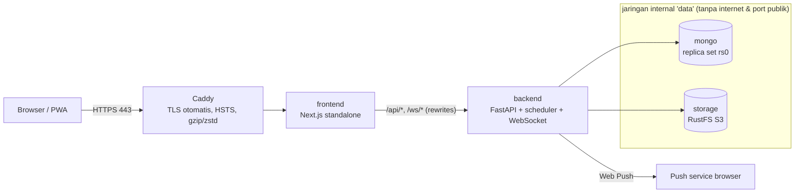

# ReadQuest — Panduan Deployment

Dokumen ini menjelaskan cara menjalankan ReadQuest di production. Jalur yang direkomendasikan
adalah **satu server (VPS) dengan Docker Compose**: `deploy/docker-compose.yml` menjalankan
seluruh stack, dengan HTTPS otomatis dari Caddy. Alternatif memakai layanan terkelola ada di
bagian akhir.

## 1. Arsitektur Deployment



| Layanan | Image | Port publik | Catatan |
|---------|-------|-------------|---------|
| `caddy` | `caddy:2-alpine` | 80, 443 (TCP+UDP) | Sertifikat Let's Encrypt otomatis, HTTP → HTTPS, HSTS, batas body 12 MB |
| `frontend` | `frontend/Dockerfile` | — | Next.js `output: "standalone"`, user non-root, header keamanan & CSP |
| `backend` | `backend/Dockerfile` | — | Uvicorn, user non-root, `APP_ENV=production` (wajib secret kuat, cookie `Secure`, HTTPS) |
| `mongo` | `mongo:7` | — | Replica set satu node (transaksi multi-dokumen) |
| `storage` | `rustfs/rustfs:1.0.0` | — | Object storage S3-compatible untuk foto; bucket dibuat otomatis oleh backend |
| `seed` | image backend | — | Profil `tools`, dijalankan manual sekali (idempoten) |

## 2. Prasyarat

- Server Linux (min. 2 vCPU, 2–4 GB RAM, 20 GB disk) dengan **Docker Engine 24+** dan Compose v2.
- **Domain** dengan record DNS A/AAAA yang mengarah ke IP server, misalnya `baca.perusahaan.co.id`.
- Port **80 dan 443** terbuka di firewall. Port 80 dipakai validasi ACME dan redirect ke HTTPS.
- HTTPS wajib, karena Service Worker, Web Push, dan cookie `Secure` hanya bekerja di HTTPS.

## 3. Instalasi Pertama

```bash
git clone https://github.com/keithblue9/ReadQuest.git
cd ReadQuest/deploy
cp .env.example .env
```

Isi `deploy/.env` (file ini **tidak di-commit**, sudah tercakup di `.gitignore`):

| Variabel | Wajib | Keterangan |
|----------|-------|------------|
| `DOMAIN` | ✅ | Domain publik, tanpa `https://` |
| `ACME_EMAIL` | ✅ | Email untuk notifikasi Let's Encrypt |
| `JWT_SECRET` | ✅ | Min. 32 karakter: `openssl rand -base64 48` |
| `S3_ACCESS_KEY`, `S3_SECRET_KEY` | ✅ | Kredensial RustFS (secret min. 8 karakter): `openssl rand -base64 24` |
| `S3_BUCKET` | — | Default `readquest-photos` |
| `VAPID_PUBLIC_KEY`, `VAPID_PRIVATE_KEY`, `VAPID_SUBJECT` | — | Web Push. Kosong = push nonaktif, lonceng in-app tetap jalan |
| `ADMIN_EMAIL`, `ADMIN_PASSWORD`, `ADMIN_NAME` | seed | Admin pertama (password min. 8 karakter) |
| `SEED_INVITE_CODE` | seed | Kode undangan awal untuk Member |
| `MONGODB_DB`, `TAG` | — | Nama database (default `readquest`) dan tag image |

Build, jalankan, lalu seed data awal:

```bash
docker compose build
# (opsional) buat kunci VAPID lalu salin ke .env:
docker run --rm readquest-backend python -m app.scripts.generate_vapid

docker compose up -d
docker compose ps                                  # semua layanan harus "healthy"/"running"
docker compose --profile tools run --rm seed       # role, aturan poin, badge, admin pertama
```

Buka `https://DOMAIN`, masuk sebagai admin, selesaikan onboarding, lalu bagikan tautan undangan
dari **Panel Admin → Undangan** (`https://DOMAIN/register?code=KODE`).

> Seed hanya menambah data yang belum ada, jadi aman dijalankan ulang. Setelah admin pertama
> dibuat, `ADMIN_PASSWORD` boleh dihapus dari `.env`.

### Build di balik proxy TLS korporat

Bila `npm ci` atau `uv sync` gagal karena sertifikat proxy, berikan CA lewat BuildKit secret.
CA ini tidak ikut tersimpan di image:

```bash
docker build --secret id=ca,src=/path/ca.crt -t readquest-backend ../backend
docker build --secret id=ca,src=/path/ca.crt --build-arg API_PROXY_TARGET=http://backend:8000 \
  -t readquest-frontend ../frontend
```

## 4. Verifikasi Setelah Deploy

```bash
curl -I https://DOMAIN/login            # 200 + strict-transport-security + content-security-policy
curl -I http://DOMAIN/                  # 308 → https
docker compose logs -f backend          # tidak ada error startup; scheduler aktif
```

Cek manual:
- Daftar via tautan undangan, mulai sesi baca, unggah foto, lalu posting muncul di feed.
- **Reading Room** menampilkan "… di ruangan" (WebSocket lewat Caddy → Next.js → FastAPI).
- **Pengaturan notifikasi → Kirim tes** (bila VAPID diisi; di iOS hanya setelah dipasang ke Layar Utama).
- **Panel Admin → Dashboard → ⬇ PDF/Excel**.

## 5. Operasional

### Update versi

```bash
cd ReadQuest && git pull
cd deploy && docker compose build && docker compose up -d
docker compose --profile tools run --rm seed      # bila rilis menambah permission/pengaturan baru
```

Index MongoDB disinkronkan otomatis saat backend start (`ensure_indexes`). Pengguna yang sedang
membuka PWA akan melihat toast **"Versi baru ReadQuest tersedia · Muat ulang"**.

### Backup & restore

```bash
# MongoDB (harian, simpan di luar server)
docker compose exec -T mongo mongodump --archive --gzip --db readquest > readquest-$(date +%F).archive.gz
docker compose exec -T mongo mongorestore --archive --gzip --drop < readquest-YYYY-MM-DD.archive.gz

# Foto (volume RustFS)
docker run --rm -v readquest-prod_storage-data:/data -v "$PWD":/backup alpine \
  tar czf /backup/storage-$(date +%F).tar.gz -C /data .
```

Volume penting: `readquest-prod_mongo-data`, `readquest-prod_storage-data`, dan
`readquest-prod_caddy-data` (sertifikat).

### Log & pemantauan

- `docker compose logs -f backend frontend caddy`. Access log backend mencatat IP klien asli
  (dari `X-Forwarded-For` yang diisi Caddy).
- Health check: backend `GET /health` (termasuk ping MongoDB), frontend `GET /offline`. Docker
  menandai container `unhealthy` bila gagal.
- Audit perubahan konfigurasi tersedia di **Panel Admin → Audit Log**.

### Rotasi secret

- **JWT_SECRET**: ganti lalu `docker compose up -d backend`. Semua sesi login berakhir (pengguna login ulang).
- **VAPID**: kunci baru membuat langganan push lama tidak valid; pengguna perlu mengaktifkan push lagi.
- **S3**: ganti di `.env`, lalu restart `storage` dan `backend` bersamaan.

## 6. Keamanan Production (checklist)

- [x] `APP_ENV=production` menolak start bila `JWT_SECRET` lemah, `COOKIE_SECURE` mati,
      `FRONTEND_ORIGIN` bukan HTTPS, atau kredensial S3 kosong.
- [x] Hanya Caddy yang membuka port. MongoDB & storage berada di jaringan `internal` tanpa internet.
- [x] HTTPS + HSTS (Caddy), CSP & header keamanan (Next.js), `nosniff`/`DENY`/`no-store` (FastAPI).
- [x] Dokumentasi OpenAPI (`/docs`, `/openapi.json`) dimatikan di production.
- [x] Batas ukuran request 12 MB (Caddy & FastAPI). Upload foto dibatasi lagi oleh `upload.max_bytes`.
- [x] Rate limit per IP/user. Token WebSocket dikirim sebagai pesan, bukan di URL, sehingga tidak tercatat di log.
- [x] Container berjalan sebagai user non-root. Secret hanya ada di `deploy/.env`, tidak di image.
- [ ] Backup terjadwal & uji restore berkala (tanggung jawab operator).
- [ ] Untuk data sangat sensitif, aktifkan autentikasi MongoDB atau gunakan MongoDB Atlas.

## 7. Batasan Skala

Backend dirancang untuk **satu instance**:
- Scheduler sudah aman bila berjalan di beberapa instance (lease di koleksi `job_locks`).
- Presence **Reading Room** dan **rate limit** disimpan di memori proses. Untuk scale horizontal,
  pindahkan keduanya ke Redis (pub/sub untuk broadcast, counter untuk rate limit).

Untuk satu tim/organisasi (ratusan hingga beberapa ribu anggota), satu instance backend sudah
cukup.

## 8. Alternatif: Layanan Terkelola

| Komponen | Opsi | Konfigurasi |
|----------|------|-------------|
| Database | MongoDB Atlas (replica set bawaan) | `MONGODB_URI=mongodb+srv://…` |
| Object storage | Cloudflare R2 / AWS S3 | `S3_ENDPOINT_URL`, `S3_REGION`, `S3_ACCESS_KEY`, `S3_SECRET_KEY`, `S3_BUCKET` |
| Backend | Fly.io, Cloud Run, Railway (image `backend/Dockerfile`) | Satu instance minimum & maksimum. Set `FORWARDED_ALLOW_IPS` ke alamat proxy platform |
| Frontend | Container `frontend/Dockerfile` di platform yang sama | Build arg `API_PROXY_TARGET=https://alamat-backend-internal` |

Backend tetap harus dipanggil lewat origin frontend (rewrites Next.js) agar cookie refresh
token `SameSite=Strict` bekerja.
